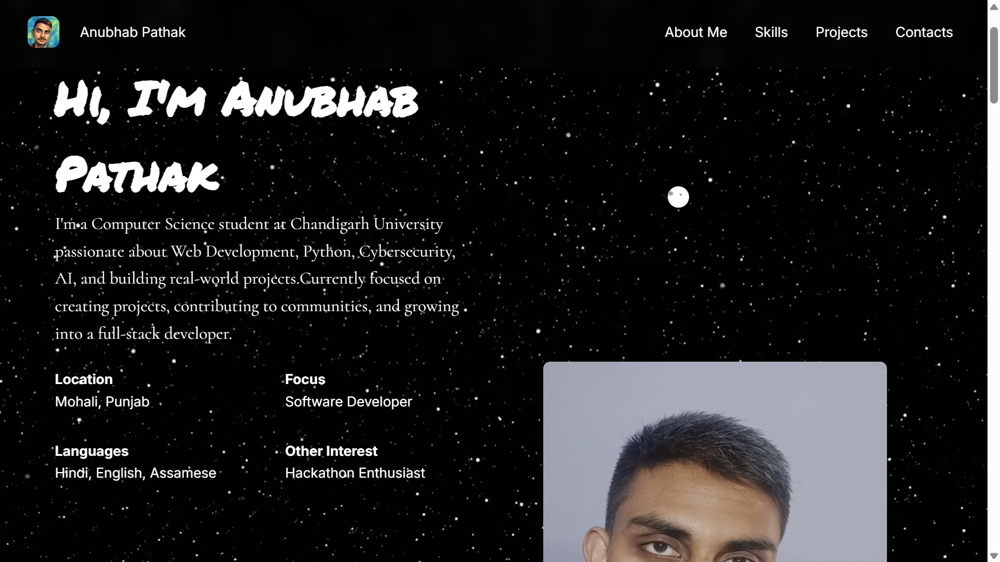
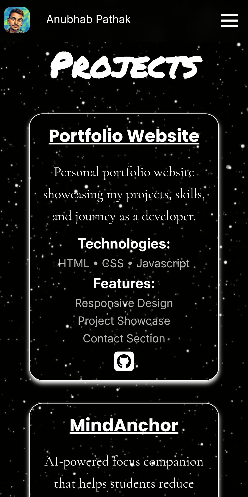
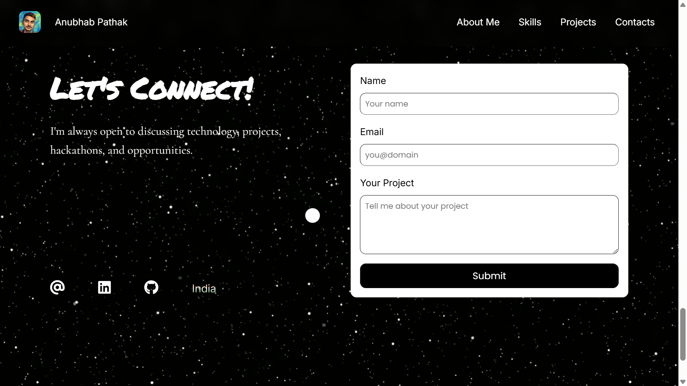
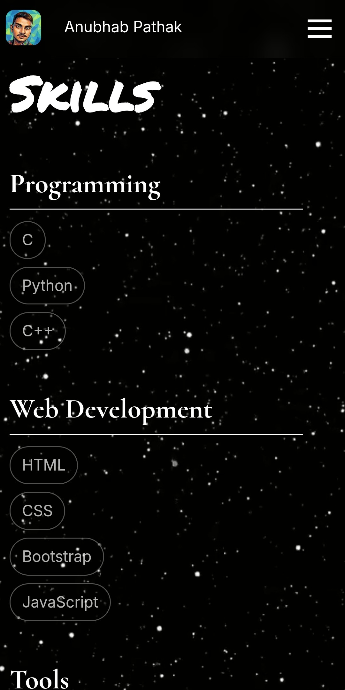

# Personal Portfolio Website

A modern, responsive personal portfolio website built to showcase my skills, projects, education, and journey as a Computer Science student and aspiring developer.

This portfolio represents my learning journey in web development and acts as a central place to display my projects, technical skills, and achievements.

## 🌐 Live Demo

🔗 Website: https://anu-aracnade.github.io/anubhab-portfolio-website/


## 📸 Preview

<table width="100%">
  <tr>
    <td width="65%" align="center" valign="top">
      <p><b>Desktop Preview</b></p>
      
    </td>
    <td width="20%" align="center" valign="top">
      <p><b>Mobile Preview</b></p>
      
    </td>
  </tr>
</table>

<table width="100%">
  <tr>
    <td width="65%" align="center" valign="top">
      <p><b>Desktop Preview</b></p>
      
    </td>
    <td width="20%" align="center" valign="top">
      <p><b>Mobile Preview</b></p>
      
    </td>
  </tr>
</table>


## ✨ Features

- 🎨 Modern and clean user interface
- 📱 Fully responsive design for different screen sizes
- 🧭 Smooth navigation between sections
- 👨‍💻 About Me section
- 🛠️ Skills showcase
- 🎓 Experience & Education details
- 📂 Projects section
- 📬 Contact section
- 🌙 Interactive features using JavaScript


## 🛠️ Tech Stack

- HTML5
- CSS3
- JavaScript


## 📂 Project Structure

```text
portfolio-website/

├── index.html
├── style.css
├── script.js
├── assets/
│   ├── fevicons/
│   ├── images/
│   └── videos/
├── privacy/
│   ├── privacy.html
│   ├── style_privacy.css
│   └── script_privacy.js
├── LICENCE
└── README.md
```


## 🚀 Getting Started

To run this project locally:

### 1. Clone the repository

```bash
git clone https://github.com/Anu-aracnade/anubhab-portfolio-website.git
```

### 2. Open the folder

```bash
cd portfolio-website
```

### 3. Run

Open `index.html` in your browser.


## 📌 Sections Included

### 🏠 Home
Introduction and quick overview.

### 👤 About
A brief introduction about me, my interests, and my developer journey.

### ⚡ Skills
Technologies and tools I am currently learning and working with.

### 🏆 Experience
My involvement in technical communities, clubs, hackathons, and collaborative activities.

### 🎓 Education
Details about my academic background, Computer Science Engineering journey, and relevant learning areas.

### 💻 Projects
A collection of my development projects.

### 📞 Contact
Ways to connect with me.


## 🎯 Purpose of This Project

This project was created to:

- Strengthen my frontend fundamentals
- Practice responsive web design
- Improve UI development skills
- Build my developer portfolio
- Maintain visible proof of my learning journey


## 🔮 Future Improvements

- Add 
- Add dark/light theme toggle
- Improve accessibility
- Add more JavaScript interactions
- Connect contact form with **backend server for data-processing (MongoDB for databases)**
- Convert into React version


## 👨‍💻 Author

**Anubhab Pathak**

- Computer Science Engineering Student
- Interested in Web Development, AI/ML, Cybersecurity & Software Engineering

GitHub: https://github.com/Anu-aracnade

LinkedIn: https://linkedin.com/in/anubhab-p-7bbb3b365
   
---

⭐ If you like this project, consider giving it a star! 🤗
